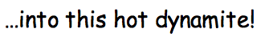
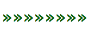

UNIX Bootstrap
===

Are you tired of looking for UNIX tools and tutorials and coming upon pages that look like somebody spent time styling them? Let's be honest: this hardly inspires confidence in the content on the page. In fact, for UNIX afficianados, the result is precisely the opposite.

Enter **UNIX Bootstrap**, a powerful, cutting-edge new CSS library that enables you to design UNIX pages for UNIX devotees!

Just what kinds of things can you do with UNIX Bootstrap? Well, let's dive in!

#### Make a banner using the `banner` class

Turn this mess

<h4>Welcome to my awk tutorial!</h4>

into GOLD:

#### Text done right

Here's some plain text  

#### Spice up your font with the `fancy` class

Turn this plain Jane text…

#### Let's set the mood with the `ambience` class

Here's a `
` without ambience…

#### Putting some umph into your arrows with the `green-arrow` class

Here are some boring arrows:

»»»»»»»»

And here are some confident, shimmering ones!

Inspired by [Geocities Bootstrap](http://divshot.github.io/geo-bootstrap/).